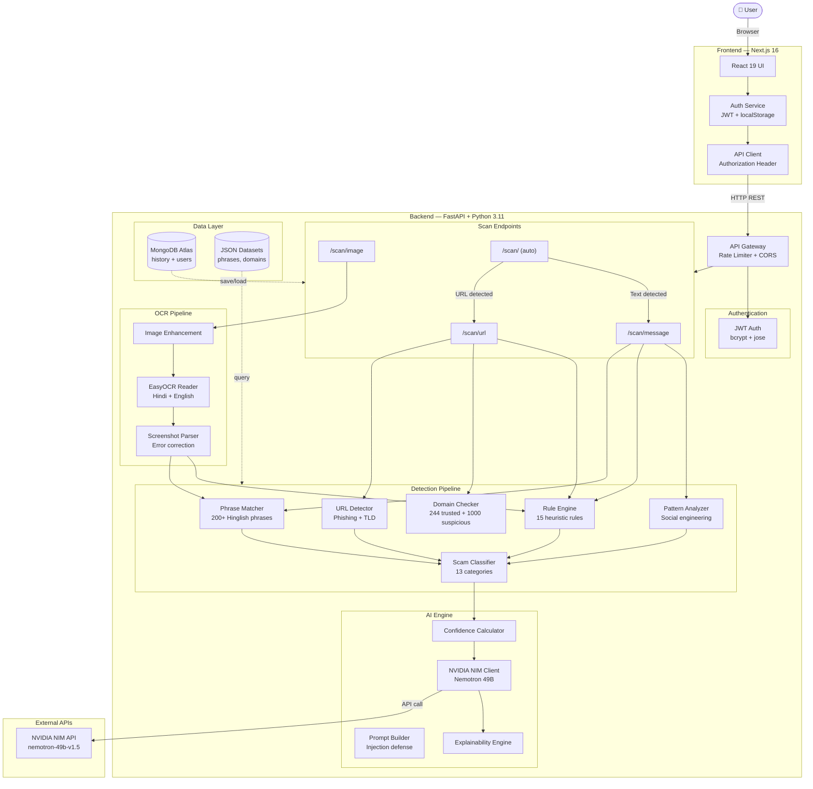
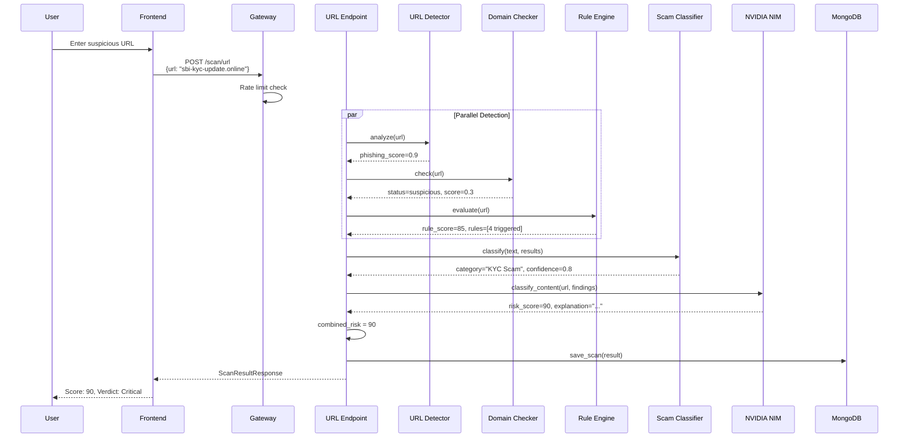
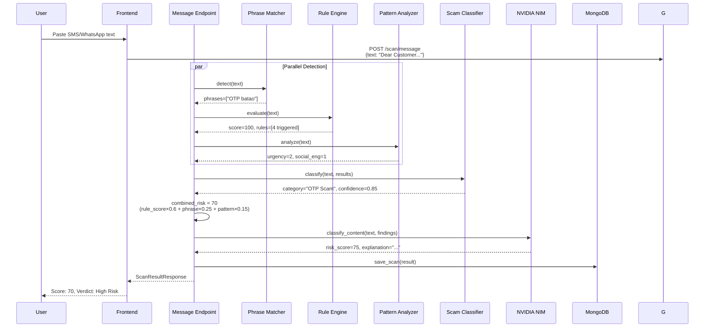
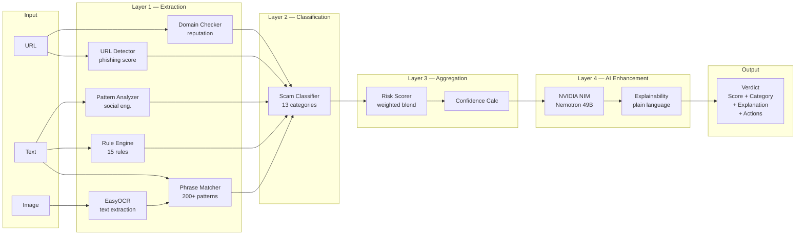
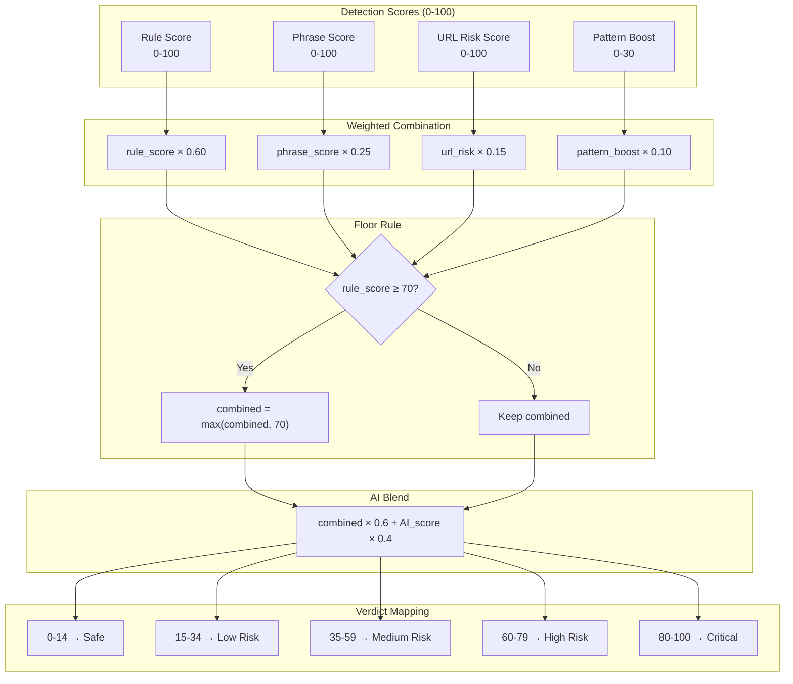
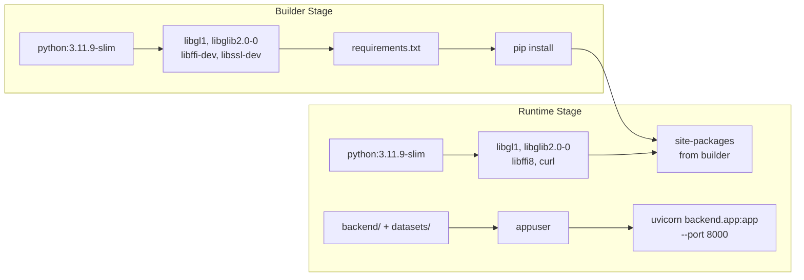
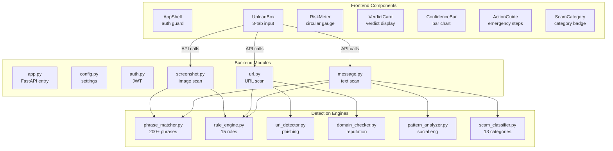

# TrustLens AI — System Architecture

> Visual architecture documentation with Mermaid diagrams.

---

## High-Level System Architecture



---

## Request Flow — URL Scan



---

## Request Flow — Message Scan



---

## Detection Pipeline Architecture



---

## Scoring Model



---

## Deployment Architecture

```mermaid
graph TB
    subgraph Users ["Users"]
        Browser[Browser]
        Mobile[Mobile Browser]
    end

    subgraph Vercel ["Vercel — Frontend"]
        FE[Next.js 16<br/>trustlens-ai.vercel.app]
    end

    subgraph Render ["Render — Backend"]
        BE[Docker Container<br/>FastAPI + EasyOCR]
        HEALTH[/health endpoint]
    end

    subgraph External ["External Services"]
        MDB[(MongoDB Atlas<br/>Cluster0)]
        NIM[NVIDIA NIM API<br/>Nemotron 49B]
    end

    Browser --> FE
    Mobile --> FE
    FE -->|API calls| BE
    BE -->|auth + data| MDB
    BE -->|AI analysis| NIM
    HEALTH -->|30s check| BE
```

---

## Docker Build Pipeline



---

## Component Map


