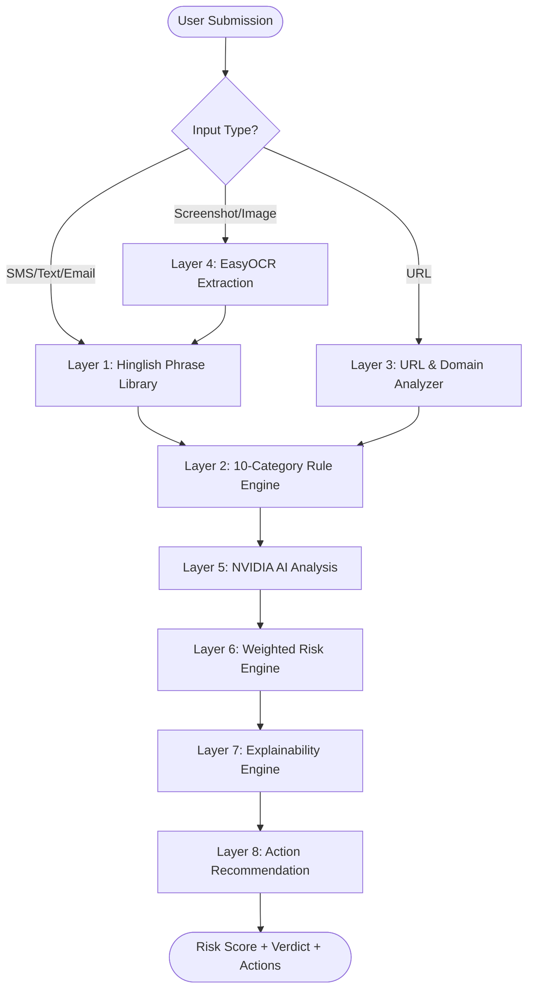

# TrustLens AI - System Architecture

## Component Breakdown

1. **FastAPI REST API**: High-performance asynchronous API layer built on Pydantic v2 validation models.
2. **Hinglish Scam Phrase Library**: Fuzzy string matching dataset trained on real-world Indian phishing messages.
3. **EasyOCR Pipeline**: Preprocesses images (CLAHE contrast & binarization) to extract text from WhatsApp chats and UPI receipts.
4. **NVIDIA NIM LLM**: Connects asynchronously to `meta/llama-3.3-70b-instruct` for deep context classification.
5. **Motor MongoDB Layer**: Async document persistence for scan history, reports, and audit logs.
