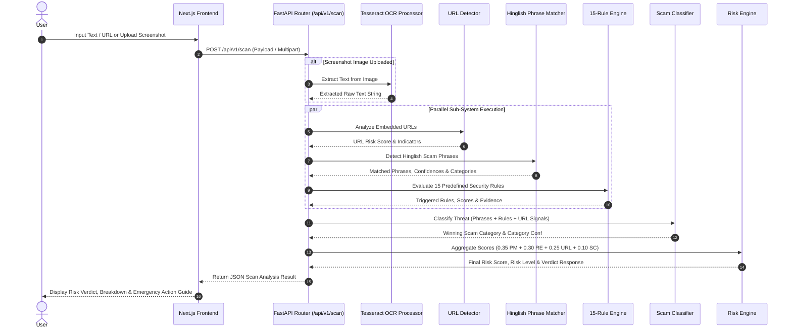

# System Workflow Document: TrustLens AI

**Project Name:** TrustLens AI  
**Tagline:** Detect. Explain. Protect.  
**Author:** Technical Lead & Quality Assurance Lead  
**Date:** July 25, 2026  
**Document Status:** Complete Workflow Specification  

---

## 1. End-to-End Analysis Workflow Diagram

---

## 2. Detailed Step-by-Step Execution Sequence

### Step 1: Input Ingestion & Pre-Processing
1. **Client Submission:** User submits a URL, SMS/WhatsApp text string, email body, or screenshot file via the frontend Next.js interface.
2. **Payload Validation:** FastAPI router validates input schema using Pydantic models.
3. **OCR Processing (If Image Input):**
   - If an image file is uploaded, `ScreenshotOCR` converts the image to grayscale and applies OTSU thresholding.
   - Tesseract OCR extracts text characters and returns clean text string.

### Step 2: URL Detection Pipeline
1. **URL Extraction:** RegEx extracts all HTTP/HTTPS links from the text.
2. **Domain Isolation:** Extract root domain and subdomains.
3. **Whitelist Check:** Checks domain against `trusted_domains.json`. If trusted, URL risk is set to `0.0`.
4. **Phishing Checks:**
   - Checks suspicious TLD against list (`.xyz`, `.top`, `.club`, `.work`).
   - Evaluates domain squatting by comparing domain against bank alias lists (`bank_names.json`).
   - Detects URL shortener usage (`bit.ly`, `tinyurl`).
   - Computes `final_url_risk` score (0.0 to 1.0).

### Step 3: Hinglish Phrase Matching Pipeline
1. **Normalization:** Input text is lowercased and special characters/punctuation are removed.
2. **Exact Matching:** Scans text against 210 entries in `hinglish_phrases.json`.
3. **Variation Matching:** Checks common spelling variations associated with each phrase entry.
4. **Fuzzy Sequence Matching:** Performs similarity matching using `SequenceMatcher` (threshold = 0.80).
5. **Score Output:** Returns matched phrase list, match types, confidence scores, and scam categories.

### Step 4: Rule Engine Evaluation
1. **Rule Checks:** Evaluates text against 15 rules (`R001 Urgency`, `R002 Credential Request`, `R003 Payment Request`, `R004 Brand Impersonation`, `R005 Account Threat`, `R006 Reward Offer`, `R008 Unknown Sender`, `R013 Authority Impersonation`, etc.).
2. **Safety Safeguards:** Checks for negative security advisories (e.g., `"do not share"`, `"never share"`) to suppress false positive credential alarms.
3. **Score Output:** Returns array of triggered rule dicts and `total_risk_from_rules`.

### Step 5: Threat Classification
1. **Multi-Source Evidence Aggregation:** Combines phrase matches, triggered rules, and URL risk.
2. **Keyword Scoring:** Computes category weights across 14 scam types (Fake KYC, UPI Fraud, OTP Scam, Job Scam, Delivery Scam, etc.).
3. **Category Determination:** Returns primary scam category and category confidence score.

### Step 6: Multi-Layer Risk Aggregation & Verdict Generation
1. **Weighted Risk Score Computation:**
   $$\text{Score} = 0.35 \times S_{\text{phrase}} + 0.30 \times S_{\text{rules}} + 0.25 \times S_{\text{url}} + 0.10 \times S_{\text{pattern}}$$
2. **Level Assignment:** Assigns risk level (`safe`, `low`, `medium`, `high`, `critical`).
3. **Explainability Generation:** Formulates non-technical explanation, confidence metric, and step-by-step prevention guide.

### Step 7: Frontend Presentation & User Action
1. **UI Rendering:** Displays risk badge, color-coded status bar, weighted breakdown charts, and plain-language explanation.
2. **Emergency Action Workflow:** Provides one-click action buttons (e.g., "Report to 1930 Helpline", "Copy Warning Message", "Block Number").

---

*Workflow Specification certified by Quality Assurance Lead.*
